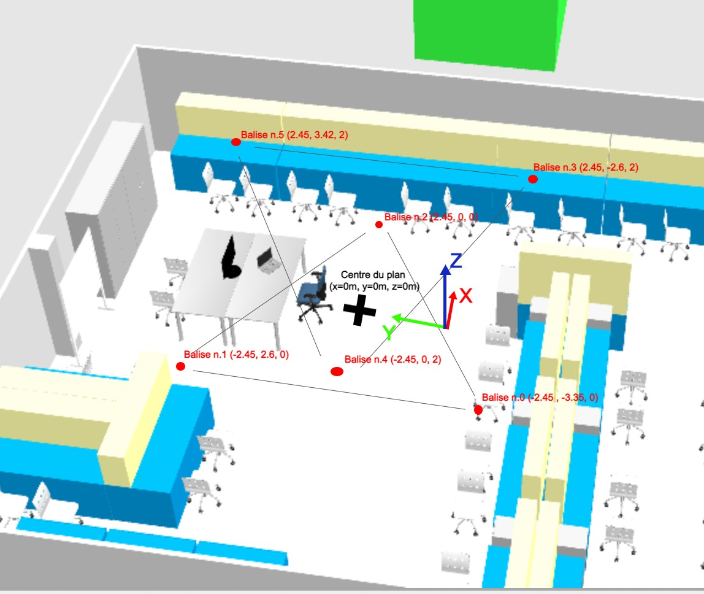
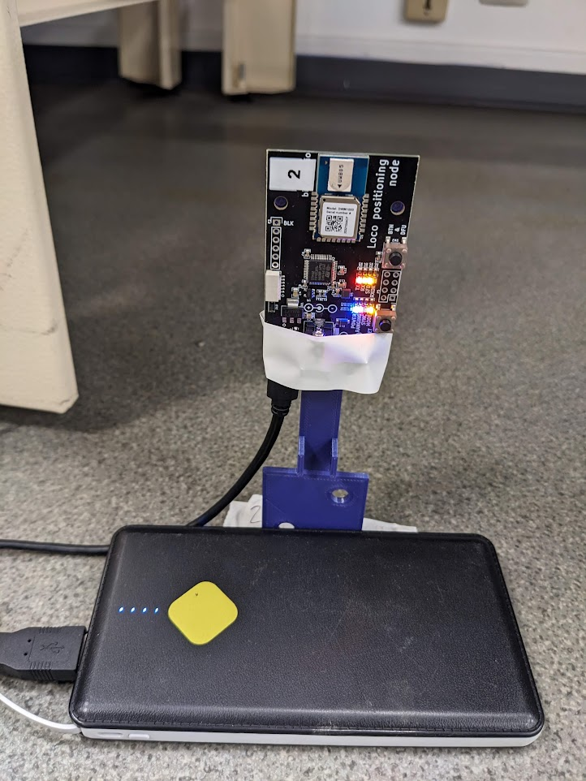
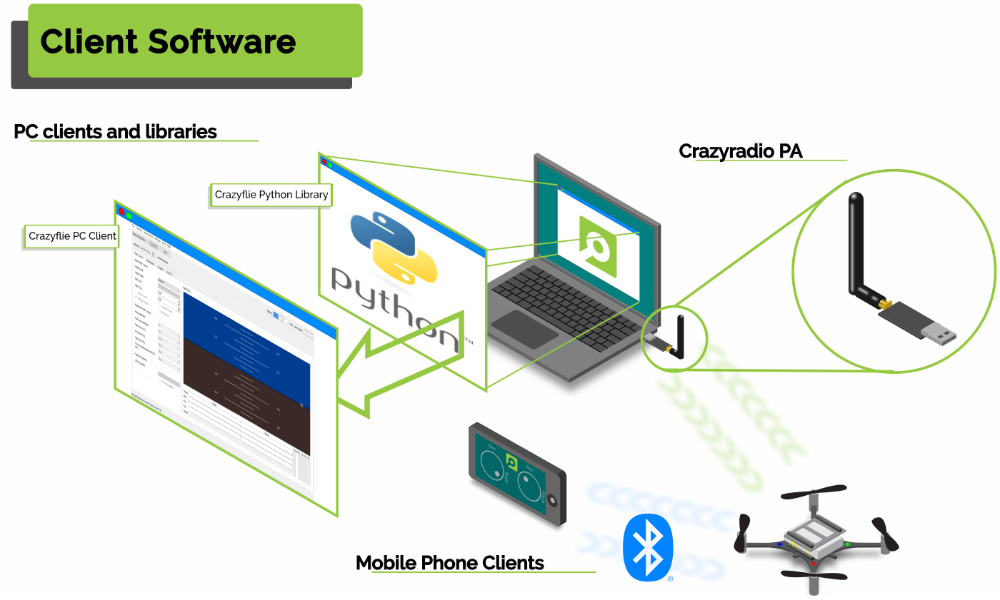
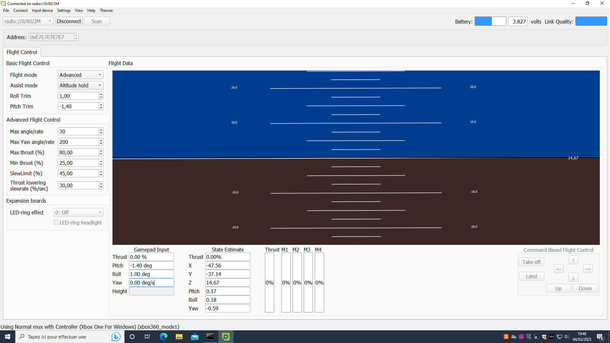
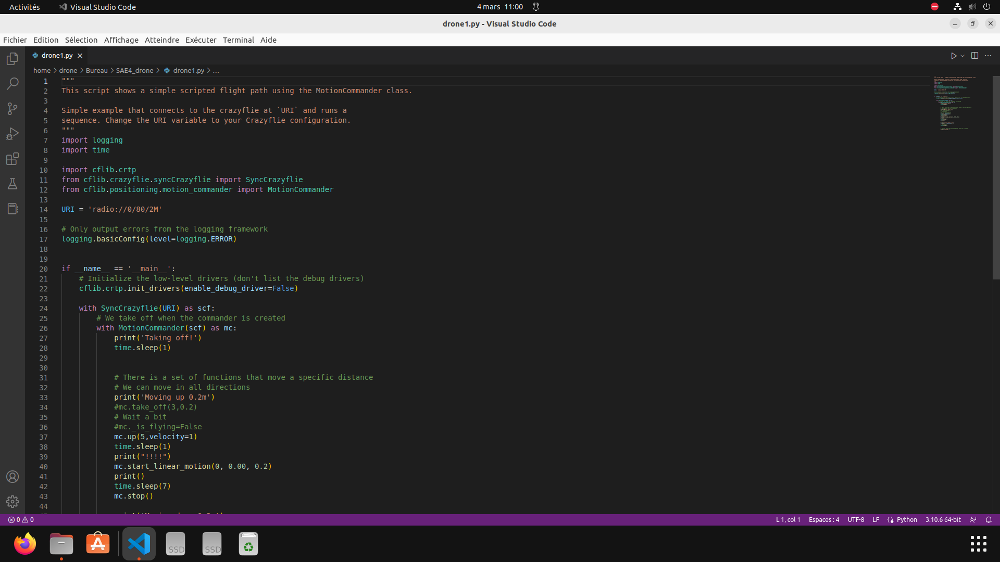
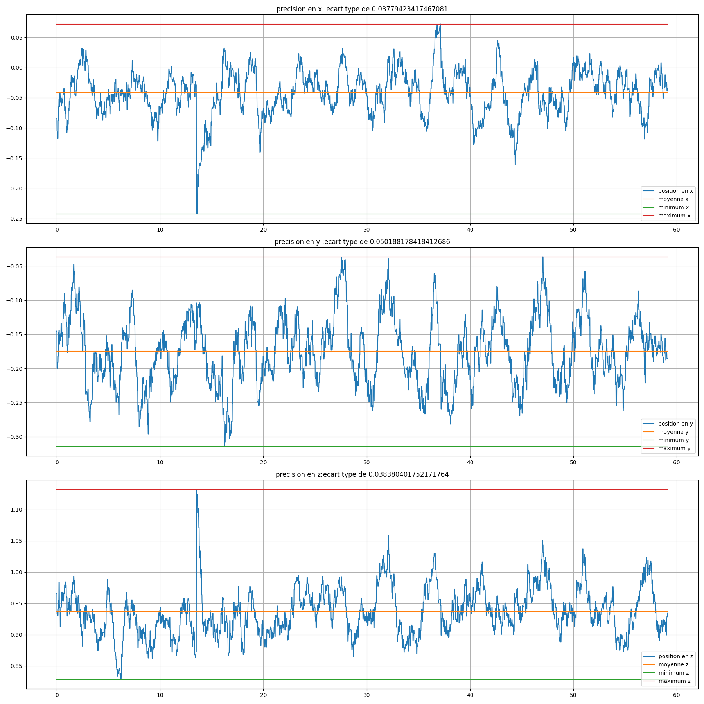
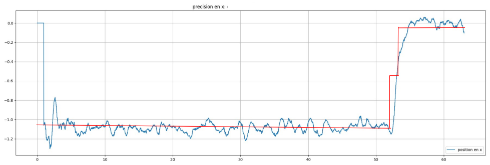
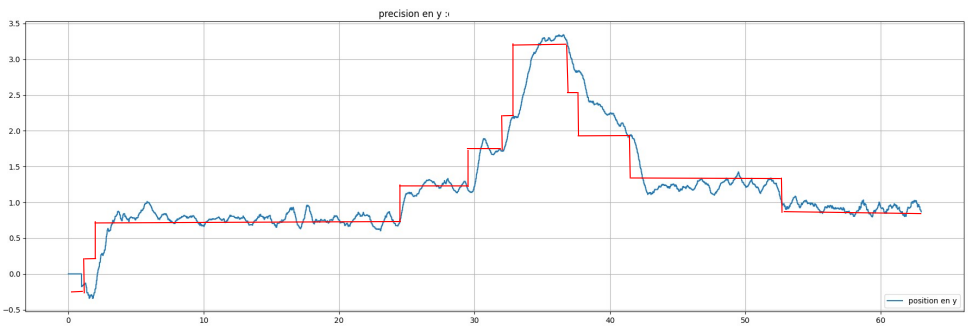
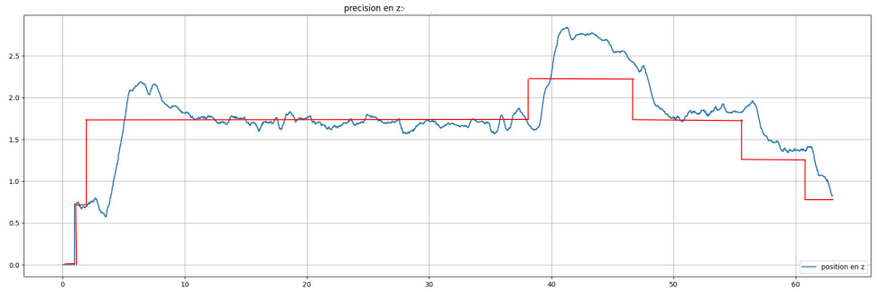
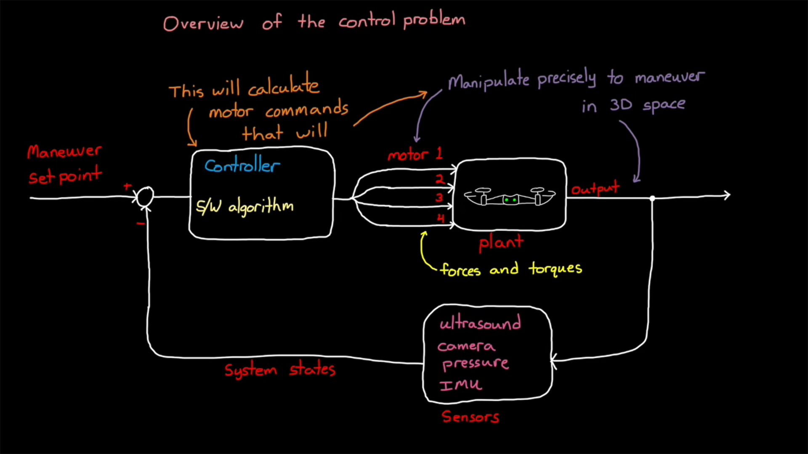

# Bienvenue sur le projet SAE 4 Drones 

### Equipe : Alexandre BADER / Kévin TRAN / Romain KLEINKLAUS / Aklaa MAYABA

### Référents : M. Eric HUEBER / M. Benjamin MOURLLION 

## Guide d'installation et de fonctionnement de notre SAE

### Installation et initialisation du matériel 

Nous allons nous intéressé à l'installation du matériel du kit Crazyflie qui a été fournit. (https://store.bitcraze.io/products/the-swarm-bundle?variant=39540519206999)

- Commencer par charger les drône à l'aide d'un câble micro USB 
> 40 minutes de charge pour passer de 0% à 100%

> 7 minutes de temps de vol avec une charge complète du drone

#### Installation des balises pour l'initialisation du Loco positioning System (LPS)

- Placer les 8 balises de position dans la salle B019.

> L'échelle du repère est en mètre.
> Les balises 3 et 5 sont positionnées sur les 2 tableaux blancs présents dans la salle.

- Connecter les modules aux batteries externes.

> Il faudra utiliser un câble USB vers micro USB pour alimenter les balises. 

#### Initialisation des drônes
- Appuyer sur le bouton de mise en marche / d'arrêt du drone, celui-ci s'initialise.

> On peut désormais s'y connecter depuis un PC, un téléphone ou une tablette

### Commande des drones à distance

> La communication entre les drones et les appareils utilisant le client Crazyflie se fait, sois grâce à la Crazyradio PA connecté à un PC en USB ou avec le protocole de communication Bluetooth LE. (Plus d'informations sur https://www.bitcraze.io/documentation/system/client-and-library/)

> Il est important de préciser qu'il n'est pas possible de se connecter à un drone Crazyflie depuis le Crazyflie Client et un compileur Python ou un IHM en même temps.

#### Utilisation du Crazyflie Client

Il est possible de contrôler et visualiser les différentes données envoyées par le drone et les balises en passant par le client fournis par Crazyflie. Ce client est disponible sur le Github de Crazyflie (https://github.com/bitcraze/crazyflie-clients-python). Il existe différentes versions pouvant être exécutées sur différentes plateformes comme un PC sous Windows, Linux ou Mac et des appareils sous Android ou iOS. Nous nous intéresserons au client réservé à l'utilisation sur un PC.

> Le tutoriel concernant les étapes d'installation de ce client est détaillé sur ce site : https://github.com/bitcraze/crazyflie-clients-python/blob/master/docs/installation/install.md

Sur le client, des informations concernant les drones et les balises peuvent être visualisées comme les valeurs du gyroscope du drone, sa batterie ou encore la puissance délivrée à chaque moteur en temps réel. Il est également possible de configurer la position des balises sur un plan en 3D et de visualiser la position du drone en temps réel dans ce plan. 
De plus, il est possible de contrôler le drone en temps réel dans l'espace ainsi que de le faire décoller et atterrir à l'aide de boutons physiques sur le client, ou d'une manette Xbox One connectée en USB au PC, qui nous a été fournit au début du projet.

#### Utilisation d'un programme Python

Il est également possible d'utiliser la librairie de fonctions codé en Python disponible sur le Github de Crazyflie (https://github.com/bitcraze/crazyflie-lib-python). En utilisant un compileur comme Visual Studio Code, on peut utiliser cette libairie pour contrôler et visualiser les données envoyées par le drone et les balises.

#### Utilisation d'une IHM

En tant qu'alternative au Crazyflie Client, il est possible d'utiliser l'IHM que nous avons réalisé. Celui-ci permet également de se connecter et de contrôler les drones à distance et en temps réel ainsi qu'à observer des informations comme la batterie des drones ou encore leur position dans un plan.

## Contrôle des drones dans les airs

### A propos de la performance du drone dans les airs

#### Utilisation des fonctions de déplacement des drones de la librairie fournit

Lors de l'utilisation de fonctions permettant de déplacer le drone dans les airs sans l'exploitation de quelconques informartions de position, il faut préciser une commande de vitesse pour les moteurs lors de chaque déplacement. Le résultat de l'utilisation de ces fonctions n'est pas toujours le même, nous avons remarqué que le niveau du batterie d'un drone va influer sur la puissance délivrer au moteur quelque soit la commande de vitesse envoyée.
Il était donc très compliqué de stabiliser le drone dans les airs avec ces fonctions, les déplacements étant très instable et non précis, les fonctions créant un résultat différent à chaque exécution.

#### Utilisation des fonctions de déplacement exploitant la position du drone

Lors de l'utilisation de fonctions de déplacement exploitant la position du drone dans le plan crée par les balises, l'influence de la batterie sur la puissance délivrée au moteur ne nous posait plus autant de problème quant à la stabilisation du drone dans les airs et de la précision des déplacements.

### Graphiques des différents tests de performance

#### Mesures des positions lorsque le drone est immobile

Pour la réalisation de cette mesure, nous avons placé le drone au milieu du plan à 1 mètre du sol pour éviter une mesure en z non précise (la mesure n'est pas précise lorsque le drone est au sol), donc aux coordonnées x=0,y=0,z=1 (échelle en mètre). Lors de la mesure, nous avons laissé le drone à la même position.

> Les mesures pour chaque position x,y et z ont été réalisé à une fréquence de 100 Hz pendant une minute.

On remarque que la position pour chaque axe est plus ou moins précise mais cependant très instable lorsque le drone est immobile.

#### Mesures des positions lorsque le drone est en mouvement

Lors de la réalisation de ces mesures, nous avons déplacé le drone dans les airs en lui envoyant des consignes de position x,y,z à l'aide de commandes clavier en temps réel.

> La courbe en rouge sur les 3 graphiques représente la consigne en position envoyé au drone à l'aide des commandes du clavier.

> Les mesures pour chaque position x,y et z (en mètre) ont été réalisé à une fréquence de 100 Hz pendant un peu plus d'une minute.

Similaire aux mesures des positions lorsque le drone est immobile, on observe que le retour de position du drone est très instable en plus de ne pas être précis.

### Amélioration du système de contrôle de postion

#### Etude de l'asservissement des drones Parrots
Nous avons, en parallèle à notre étude des drones Crazyflie, étudié les drones Parrots et leur fonctionnement sous Matlab. Cette étude, portant plus particulièrement sur l'asservissement d'un système, nous a permis d'en apprendre plus sur le principe d'asservissement d'un drone, nous permettant de nous inspirer quant à l'application d'un asservissement sur les drones Crazyflie en nous basant sur celui appliqué aux drones Parrots.

> Ceci est un exemple d'un système de contrôle de drône asservis avec un retour des informations fournies par les capteurs du drone.

Dans ce système, nous avons en entrée une commande de position récupérée par le controlleur qui va réaliser des calculs pour faire tourner chaque hélice indépendamment les unes des autres de sorte à ce que le drone se déplace à la position envoyer à l'entrée. Ce système est bouclé, on a un retour à l'entrée des informations que fournissent les capteurs installés sur le drone, dans le but d'améliorer le système de commande en position, lui permettant de faire face aux perturbations.

## Résultats du projet

### Vidéos des tests

- Premier vol d'un drone en utilisant les fonctions de la librairie Python fournit par Crazyflie :

https://www.youtube.com/shorts/r6u5RcOwqho

- Premier vol d'un drone en utilisant la fonction "linear motion" qui utilise une commande en vélocité pour le déplacement :

https://youtube.com/shorts/18h9I9uDpAo

- Utilisation du programme de déplacement du drone par commande clavier dans le plan en exploitant sa position:

https://drive.google.com/file/d/1BtnYzqZ73ctcumUR0VBO3GJPtGSi4TIh/view?usp=sharing

### Avancées réalisées au cours du projet

- Mise en place des balises pour le Loco Positioning System
- Récupération de la position du drone depuis un programme Python
- Création d'un programme permettant le contrôle du drone en position dans la plan par commande clavier en temps réel
- Réalisation d'un IHM permettant le contrôle et l'affichage d'informations relatives aux drones en temps réel

### Perspectives d'évolution du projet

- Amélioration de l'IHM
- Contrôle de plusieurs drones en simultané
- Amélioration de la précision et de la stabilité du Loco Positioning System
- Amélioration de la performance du système de commande en position
- Réalisation d'un site internet hébergeant un IHM accessible depuis un navigateur
- Création de parcours dans le plan pour les drones 

## Ressources annexes

- Lien du Google Drive comportant toutes les images et les vidéos prisent tout au long du projet :

https://drive.google.com/drive/folders/11o1TTOyGl-006VADVPh3DjFbNICb7wwu?usp=sharing

- Lien Google Document du Rapport d'avancement du projet :

https://docs.google.com/document/d/1HfxYyNyIje6TitpfcRkIBnB1s5yutSzWl4-dF0udWbw/edit?usp=sharing

- Documentation sur les drones Crazyflie :

https://www.bitcraze.io/documentation/repository/crazyflie-firmware/master/

- Lien de la page d'achat du Kit Crazyflie :

https://store.bitcraze.io/products/the-swarm-bundle?variant=39540519206999

- Lien de la page Github du firmware des drones Crazyflie

https://github.com/bitcraze/crazyflie-firmware

- Lien de la page Github de la librairie Python pour la communication avec les drones

https://github.com/bitcraze/crazyflie-lib-python

- Lien de la page Github du code source du Client Crazyflie :

https://github.com/bitcraze/crazyflie-clients-python
