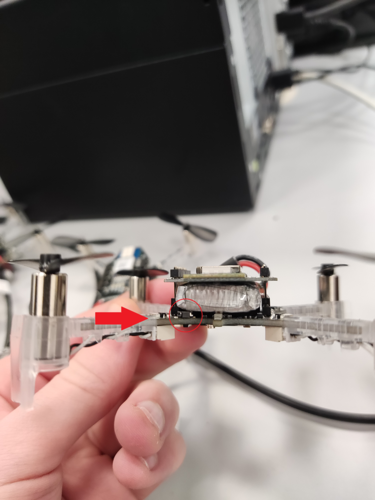

# Bienvenue sur le projet SAE4 Drones 

### Equipe : Alexandre BADER / Kévin TRAN / Romain KLEINKLAUS / Aklaa MAYABA

### Référents : M. Eric HUEBER / M. Benjamin MOURLLION 

## Guide d'installation et de fonctionnement de notre SAE

### Installation
- Commencer par charger les drône à l'aide d'un câble micro USB 
> 40 minutes de charge pour passer de 0% à 100%

> 7 minutes de temps de vol avec une charge complète du drone

#### Installation des modules loco positioning
- Placer les 8 balises de position dans la salle B019.

> L'échelle du repère est en mètre.

- Connecter les modules aux batteries externes.

> Il faudra utiliser un câble USB vers micro USB pour alimenter les balises. 

#### Initialisation des drônes
Appuyer sur le bouton d'allumage des drones, le drone s'initialise.

> On peut désormais s'y connecter depuis un PC, un téléphone ou une tablette

### Commande des drones à distance

#### Utilisation du Crazyflie Client

Il est possible de contrôler et visualiser les différentes données envoyées par le drone et les balises en passant par le client fournis par Crazyflie. Ce client est disponible sur le Github de Crazyflie (https://github.com/bitcraze/crazyflie-clients-python). Il existe différentes versions pouvant être exécutées sur différentes plateformes comme un PC sous Windows, Linux ou Mac et des appareils sous Android ou iOS. 

> Le tutoriel concernant les étapes d'installation de ce client est détaillé sur ce site : https://github.com/bitcraze/crazyflie-clients-python/blob/master/docs/installation/install.md

#### Utilisation d'un programme Python

Il est également possible d'utiliser la librairie de fonctions codé en Python disponible sur le Github de Crazyflie (https://github.com/bitcraze/crazyflie-lib-python). En utilisant un compileur comme Visual Studio Code, on peut utiliser cette libairie pour contrôler et visualiser les données envoyées par le drone et les balises.

> Il est important de préciser qu'il n'est pas possible de se connecter à un drone Crazyflie depuis le Crazyflie Client et un compileur Python en même temps

#### Vidéos des premiers tests de vol

1er test de vol en utilisant les fonctions sur Python :
https://www.youtube.com/shorts/r6u5RcOwqho

1er test de vol en utilisant la fonction linear motion qui permet de controller la velocité du vol :
https://youtube.com/shorts/18h9I9uDpAo
